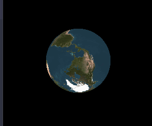

<h2 align="center"> Execução do projeto openGL </h2>

Para a execução desse projeto, utilizei o Python 3.10.6, com o pip, no Visual Studio Code e no Windows.

Logo, para executar essa pasta "openGL", deve-se baixar todos os arquivos nela contidos ou clonar a pasta, de modo que incluam os arquivos necessários. Coloque tudo em uma mesma pasta e abra-a no VS Code, a partir daí, com o Python já instalado, rode os seguintes comandos no terminal com o path do projeto:
  pip install PyOpenGL  
  pip install PyOpenGL PyOpenGL_accelerate  
  py -m pip install -U PyOpenGL-3.1.6-cp310-cp310-win_amd64.whl   
  py -m pip install -U PyOpenGL_accelerate-3.1.6-cp310-cp310-win_amd64.whl  
  py -m pip install pypng  
  pip install pysdl2  
  pip install pysdl2-dll  
  py -m pip install -U pysdl2  
  py -m pip install pysdl2-dll  
  pip install PyGLM  
  py -m pip install PyGLM  
  pip install Pillow  
  py -m pip install Pillow  
  pip install numpy  
  py -m pip install numpy  

 Por fim, basta rodar cada código com o comando: py -u "path_do_arquivo_desejado" 
 ou apenas py "path_do_arquivo_desejado".
 
  
 
 
     
 

  
 
 
     
 

